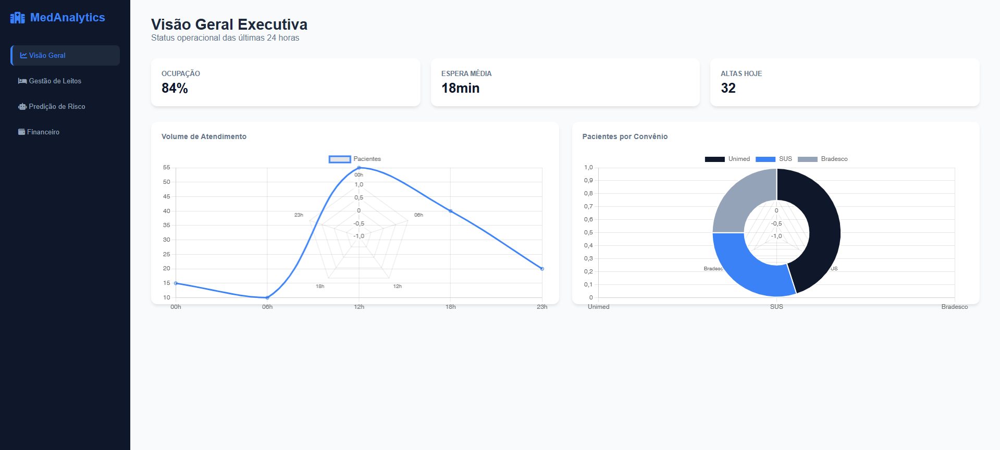
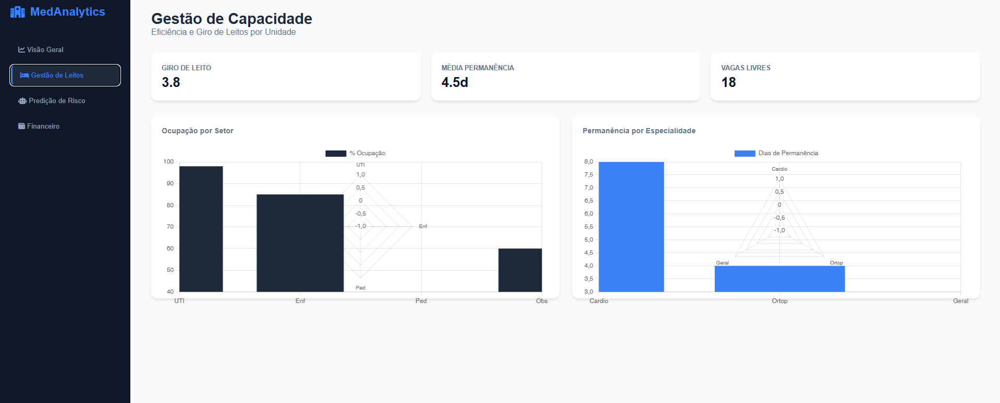
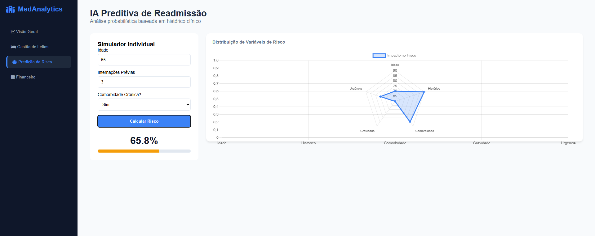
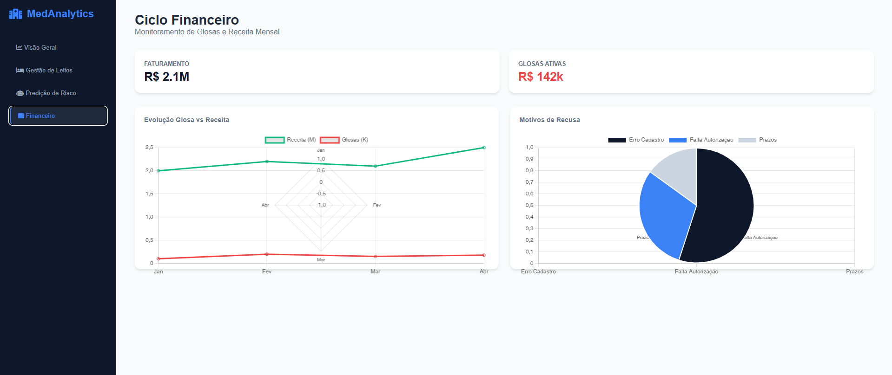

# 🏥 MedAnalytics Pro - Inteligência Hospitalar 

Este projeto é uma plataforma de **Business Intelligence (BI)** e **Análise Preditiva** voltada para a gestão hospitalar de alta performance. O sistema consolida indicadores críticos em dashboards interativos para suporte à decisão clínica e administrativa.

---

## 📸 Demonstração do Sistema

### 1. Visão Geral Executiva
Monitoramento em tempo real de ocupação, tempo de espera e fluxo de pacientes.

### 2. Gestão de Capacidade (Leitos)
Análise de giro de leito e média de permanência por especialidade para otimização operacional.

### 3. Predição de Risco com IA
Algoritmo preditivo que analisa a probabilidade de readmissão hospitalar em 30 dias.

### 4. Ciclo Financeiro
Controle de faturamento e análise detalhada de taxas de glosas por convênio.

---

## 🛠️ Tecnologias e Arquitetura

O projeto foi estruturado para simular um ambiente real de Ciência de Dados:

* **Front-end:** HTML5, CSS3 (Modern Grid/Flexbox) e JavaScript ES6+.
* **Visualização de Dados:** [Chart.js](https://www.chartjs.org/) para gráficos dinâmicos e responsivos.
* **Data Science:** Notebook Python (`notebooks/`) contendo a análise exploratória e lógica do modelo.
* **Arquitetura:** Separação clara entre camada de apresentação (`public/`) e camada de dados (`data/`).

## 📂 Estrutura do Repositório

* `data/`: Dicionário de dados e geradores de massa de teste.
* `notebooks/`: Documentação da lógica matemática e treinamento do modelo.
* `public/`: Código fonte da aplicação web (HTML, CSS, JS).
* `screenshots/`: Registro visual das funcionalidades do sistema.

---
**Desenvolvido como projeto de portfólio para Análise de Dados e Inteligência de Negócios.**